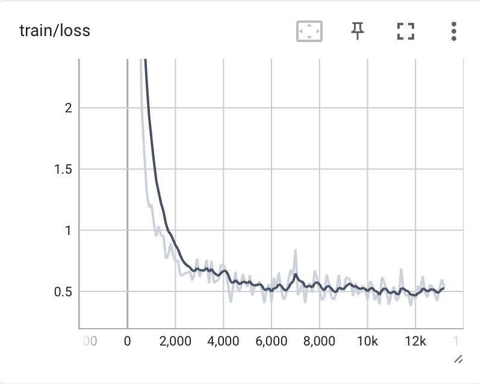

# LlamaLayout
This repository contains code to solve a Document layout prediction task using LlamaForTokenClassification.

## Dataset

For this problem, we will be using the [DocLayNet](https://huggingface.co/datasets/ds4sd/DocLayNet) dataset. It provides page-by-page layout segmentation ground-truth using bounding-boxes for 11 distinct class labels on 80863 unique pages from 6 document categories.

The dataset comes in three sizes:

-   small: 1% of the data, ~1.000k document images (691 train, 64 val, 49 test)
-   base: 10% of the data, ~10.000k document images (6.910 train, 648 val, 499 test)
- large: 100% of the data, ~100.000k document images (69.103 train, 6.480 val, 4.994 test)

## LlamaForTokenClassification 🦙

Llama for Token Classification is a Llama adaptation for token classification and is a model that receives only text in the input.
The task is formulated as a supervised token classification task that uses the LLaMa architecture. More specifically, we will use the latent representations
from the final LLaMa decoder layer, which was originally designed for next-token prediction.

In order to modify the model into a classification model, we will map the extracted representations into the dimension of the label space and then use these `logits` to classify the input.

The steps are summarised here :

- Load the base model as: `model = LlamaModel(config)`
- Get model hidden states output as: `sequence_output = model(**input_ids)`
- Add a linear layer on top of the hidden sequence_output and get logits
- Add a `TokenClassifierOutput` on top of logits


from transformers.models.llama.modeling_llama import *
from transformers.modeling_outputs import TokenClassifierOutput
```
class LlamaForTokenClassification(LlamaPreTrainedModel):
    def __init__(self, config):
        super().__init__(config)
        self.num_labels = config.num_labels
        self.model = LlamaModel(config)
        self.dropout = nn.Dropout(0.1)
        self.classifier = nn.Linear(config.hidden_size, config.num_labels)

        # Initialize weights and apply final processing
        self.post_init()
        hidden_size_llama = config.hidden_size

        self.dropout = nn.Dropout(0.1)
        self.classifier = nn.Linear(hidden_size_llama, self.num_labels)

    def get_input_embeddings(self):
        return self.model.embed_tokens

    def set_input_embeddings(self, value):
        self.model.embed_tokens = value

    @add_start_docstrings_to_model_forward(LLAMA_INPUTS_DOCSTRING)
    def forward(
            self,
            input_ids: torch.LongTensor = None,
            attention_mask: Optional[torch.Tensor] = None,
            position_ids: Optional[torch.LongTensor] = None,
            past_key_values: Optional[List[torch.FloatTensor]] = None,
            inputs_embeds: Optional[torch.FloatTensor] = None,
            labels: Optional[torch.LongTensor] = None,
            use_cache: Optional[bool] = None,
            output_attentions: Optional[bool] = None,
            output_hidden_states: Optional[bool] = None,
            return_dict: Optional[bool] = None,
    ) -> Union[Tuple, TokenClassifierOutput]:
        return_dict = return_dict if return_dict is not None else self.config.use_return_dict

        outputs = self.model(
            input_ids,
            attention_mask=attention_mask,
            position_ids=position_ids,
            past_key_values=past_key_values,
            inputs_embeds=inputs_embeds,
            use_cache=use_cache,
            output_attentions=output_attentions,
            output_hidden_states=output_hidden_states,
            return_dict=return_dict,
        )
        sequence_output = outputs[0]

        sequence_output = self.dropout(sequence_output)
        logits = self.classifier(sequence_output)

        loss = None
        if labels is not None:
            loss_fct = CrossEntropyLoss()
            loss = loss_fct(logits.view(-1, self.num_labels).cuda(), labels.view(-1).cuda())

        if not return_dict:
            output = (logits,) + outputs[2:]
            return ((loss,) + output) if loss is not None else output

        return TokenClassifierOutput(
            loss=loss,
            logits=logits,
            hidden_states=outputs.hidden_states,
            attentions=outputs.attentions,
        )
```

## Google Colab

The project includes a Jupyter notebook (`kittl_danai_14_12.ipynb`) with the following contents:
- Environment setup instructions.
- Data exploration of the DocLayNet dataset.
- Finetuning model using loRa.
- Code to produce evaluation results. 


## Training logs

Llama for Token Classification was trained for a total number of 9000 training steps, using initial learning rate of 1e-4, batch size 12, max sequence length 512, doc stride 128, warmup ratio 0.1, lora alpha 32, lora rank 16, lora drop out 0.1.

Tensorboard training logs are provided in ./llamaForTokenClassification/logs.

|  |  |  |
|-------------------------------------------------------------------------|-------------------------------------------------------------------------|-------------------------------------------------------------------------|
|  |  |  |

# Classification results

We report classification metrics for the Llama for Token Classification model.

|  | Accuracy | Precision  | Recall  |  F1-score   |
|---|---|---|---|---|
|  Test | 0.881  |  0.865 |  0.881 | 0.881 | 0.864
| Validation  | 0.893  | 0.885  | 0.893  |  0.886 |  
